# Autosite Architecture & Workflow

## 1. System Overview

Autosite is an agentic AI system that generates full-stack React applications based on user intent. It uses a **Rule-Based Intent Classifier** to determine the complexity of the app and assigns a **Default Blueprint** to ensure reliability.

### Core Components
- **Main Controller (`main.py`)**: Orchestrates the build process, handles bootstrapping, and runs `npm install`.
- **LangGraph State Machine**: Manages the flow between agents.
- **Agents**:
  - 🧠 **Planner**: Classifies intent and selects blueprints.
  - 🏗️ **Architect**: Defines file structure and component hierarchy.
  - 💻 **Coder**: Writes React/Vite/Tailwind code (src/ only).
  - 🛡️ **Validator**: Checks code against intent-specific rules.
- **Bootstrap Template**: A pre-configured `react-vite-tailwind` template that guarantees a working build environment.

---

## 2. Workflow Diagram

```mermaid
graph TD
    User[User Prompt] --> Main[Main Controller]
    Main --> Planner[🧠 Planner Agent]
    
    subgraph "Phase 1: Planning & Intent"
        Planner --> Classifier{Intent Classifier}
        Classifier -- "calculator, flames" --> Logic[Intent: logic_basic]
        Classifier -- "budget, todo" --> CRUD[Intent: crud_basic]
        Classifier -- "zomato, shop" --> Data[Intent: data_complex]
        Classifier -- "portfolio, blog" --> Static[Intent: static_ui]
        
        Logic --> Blueprint[Load Default Blueprint]
        CRUD --> Blueprint
        Data --> Blueprint
        Static --> Blueprint
    end
    
    Blueprint --> Architect[🏗️ Architect Agent]
    
    subgraph "Phase 2: Generation"
        Architect --> Structure[Define File Structure]
        Structure --> Coder[💻 Coder Agent]
        Coder --> Code[Generate React Code]
    end
    
    subgraph "Phase 3: Validation & Build"
        Code --> Validator[🛡️ Validator Agent]
        Validator --> Check{Pass Validation?}
        
        Check -- No --> Fix[Auto-Fix / Retry]
        Fix --> Coder
        
        Check -- Yes --> Bootstrap[🚀 Bootstrap Project]
        Bootstrap --> Copy[Copy Template Files]
        Copy --> Write[Write Generated src/]
        Write --> Install[Run npm install]
    end
    
    Install --> Ready[✅ App Ready]
```

---

## 3. Intent Levels & Blueprints

The system classifies every request into one of four levels to prevent over-engineering or under-delivering.

| Intent Level | Description | Required Features | Forbidden Features | Example Apps |
| :--- | :--- | :--- | :--- | :--- |
| **`static_ui`** | Content-focused sites | UI Components, Navigation | State, Auth, Backend | Portfolio, Landing Page, Blog |
| **`logic_basic`** | Simple inputs & outputs | `useState`, `onClick` | Auth, Router, Charts | Calculator, FLAMES, Converter |
| **`crud_basic`** | List management | `useState`, `map()`, Add/Delete | Auth, Backend, Charts | Budget Planner, Todo List |
| **`data_complex`** | Rich data interactions | `map()`, Filters, Modals | Real Backend (Mock only) | E-commerce, Food Delivery |

---

## 4. Agent Responsibilities

### 🧠 Planner Agent
- **Input**: User Prompt
- **Action**: 
  1. Classifies intent (Rule-based).
  2. Selects the correct JSON blueprint.
  3. Expands requirements (e.g., "FLAMES needs 2 inputs").
- **Output**: Execution Plan JSON.

### 🏗️ Architect Agent
- **Input**: Execution Plan
- **Action**: Defines the component tree and file paths.
- **Output**: File Structure JSON.

### 💻 Coder Agent
- **Input**: File Structure + Plan
- **Action**: Generates React code.
- **Constraints**: 
  - MUST use Tailwind CSS.
  - MUST use `export default`.
  - MUST NOT touch config files (`vite.config.js`, etc.).
- **Output**: Source Code Dictionary.

### 🛡️ Validator Agent
- **Input**: Generated Code
- **Action**: Validates based on **Intent Level**.
  - *Static App*: Checks for UI only.
  - *CRUD App*: Checks for `useState` and `map()`.
- **Output**: Pass/Fail Report.

---

## 5. File System Strategy

To ensure 100% build reliability, we do **not** let the AI generate configuration files.

1. **Template**: We have a verified `templates/react-vite-tailwind` folder.
2. **Bootstrap**: Python copies this template to `generated-sites/app-xxx`.
3. **Overlay**: The AI only generates files in `src/` (App.jsx, components, pages).
4. **Install**: Python runs `npm install` automatically.

This guarantees that `vite.config.js`, `package.json`, and `tailwind.config.js` are always correct.
